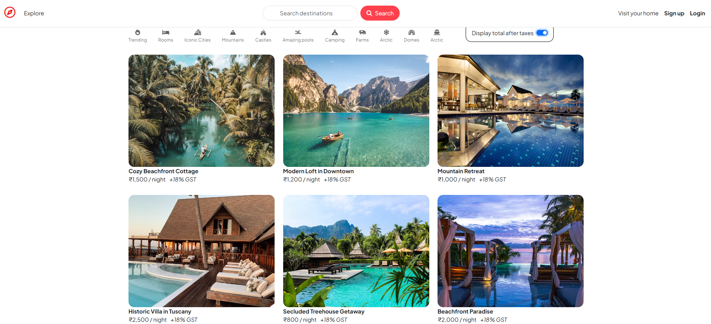
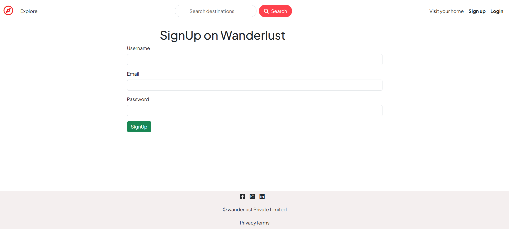
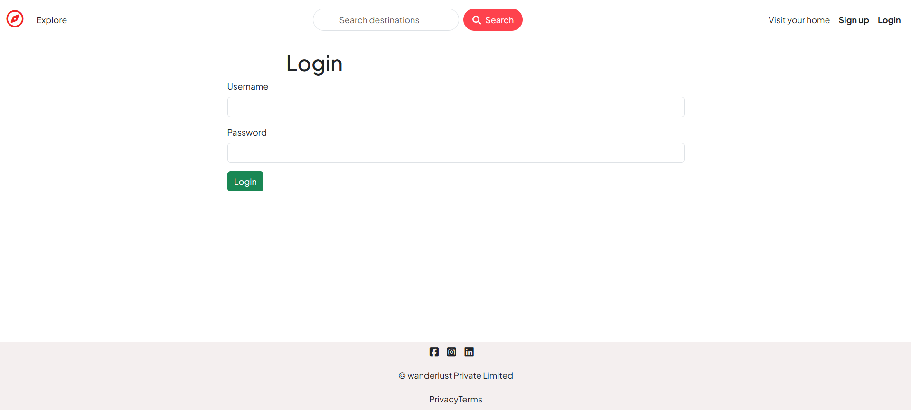
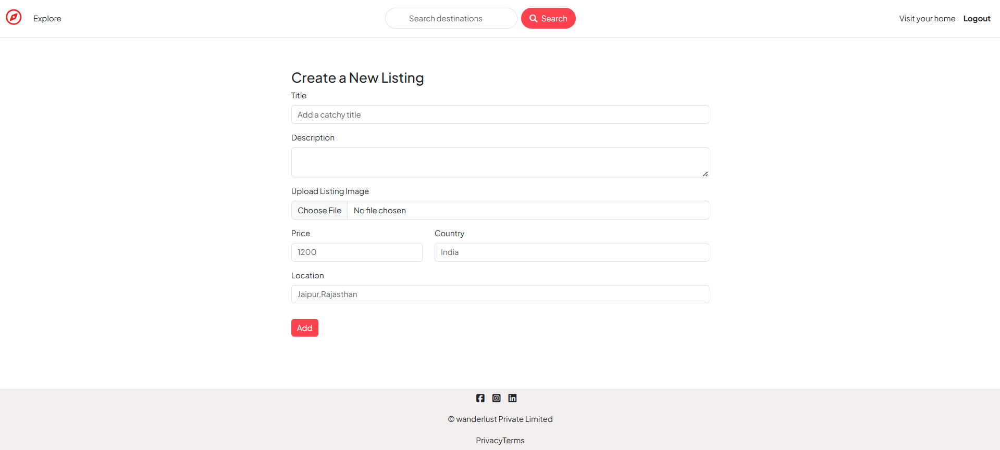
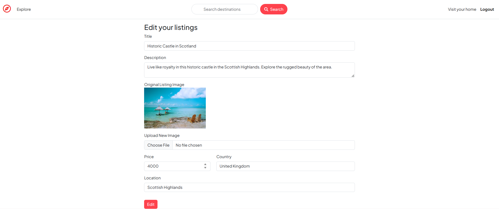
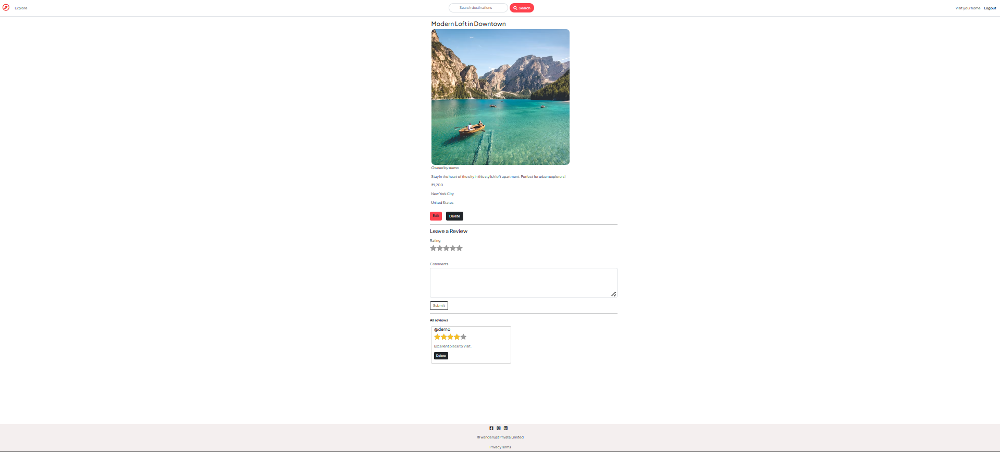
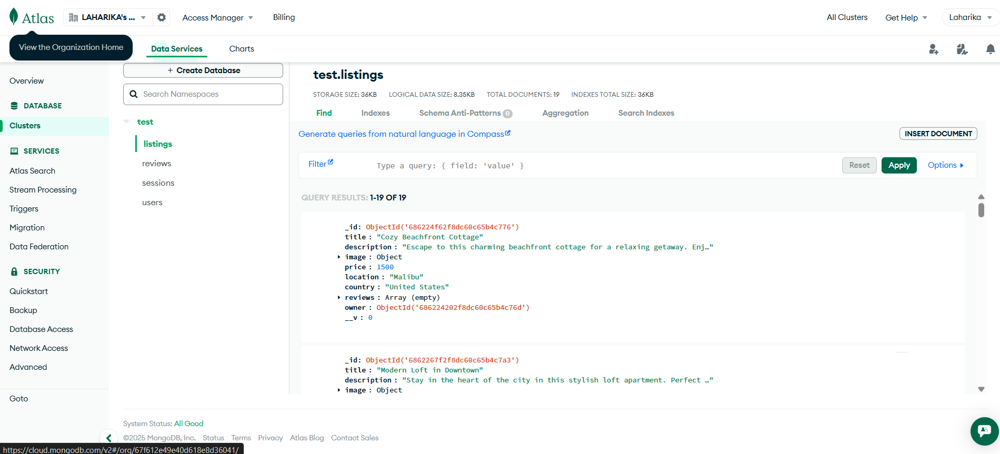
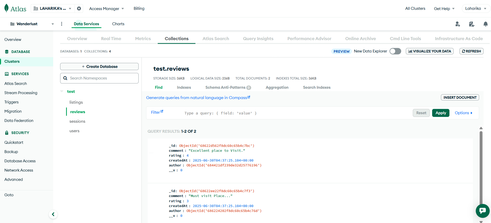
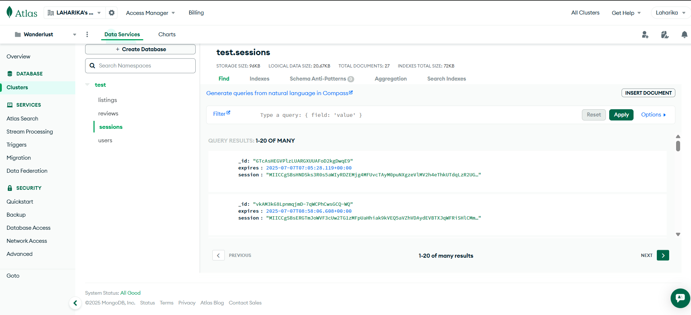

# 🧭 Wanderlust – Travel Destination Explorer

Wanderlust is a full-stack web application that allows users to explore, review, and list travel destinations. Built with **Node.js**, **Express**, **MongoDB**, and **EJS**, this app provides features like authentication, review system, and CRUD operations for travel listings.

## 🔗 Live Demo

👉 Live Site: https://wanderlust-backend-vo0p.onrender.com

📌 Note: Render may take a few seconds to wake up the server.

## 🎥 **Project Demo**

Click the link below to view a walkthrough of the Wanderlust web application:

👉 [Watch the Demo Video](https://drive.google.com/file/d/1W928SgBOYQuVE3yJY52LGSldLLv5prKv/view?usp=sharing)

## 🚀 Features

- 🗺️ Browse and view travel listings
- ➕ Add new destinations (authenticated users)
- ✏️ Edit or delete your listings
- 🌟 Add and delete reviews on listings
- 🔐 User authentication with Passport.js
- 💬 Flash messages for feedback
- 🎨 Styled using Bootstrap and custom CSS

## 🛠 Tech Stack

- **Frontend**: HTML, CSS, Bootstrap 5, EJS
- **Backend**: Node.js, Express.js
- **Database**: MongoDB (Atlas)
- **Authentication**: Passport.js with sessions
- **Templating Engine**: EJS & ejs-mate
- **Cloud Hosting**: Render
- **Media Storage (optional)**: Cloudinary

    
## 🖼️ **Screenshots**

- **Home Page** 

- **Signup Page** 

- **Login Page** 

- **NewListing Page** 

- **Editlisting Page** 

- **Reviews Page** 

- **Mongodb Entry ** 

- **Listings Entry ** 

- **Reviews Entry ** 

- **Session Store ** 

